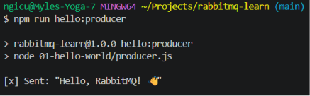
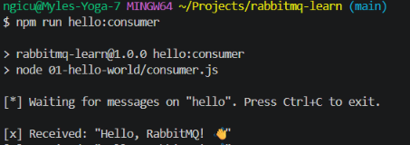

# 🐇 RabbitMQ Learning Project

A hands-on project covering the core RabbitMQ patterns, from basic messaging to
topic-based routing — each example building on the last.

---

## Prerequisites

- [Node.js](https://nodejs.org) v18+
- [Docker](https://www.docker.com) (to run RabbitMQ locally)

---

## Setup

### 1. Start RabbitMQ

```bash
docker-compose up -d
```

Open the Management UI at http://localhost:15672  
Login: `guest` / `guest`

### 2. Install dependencies

```bash
npm install
```

---

## The Four Lessons

Each lesson introduces a new concept. Run each command in a **separate terminal**.

---

### 📌 Lesson 1 — Hello World (Simple Queue)

The most basic pattern: one producer sends a message, one consumer reads it.

```
[Producer] ---> [Queue: hello] ---> [Consumer]
```

**Terminal 1** (start the consumer first):
```bash
npm run hello:consumer
```

**Terminal 2** (send a message):
```bash
npm run hello:producer
```

**What you'll learn:**
- How to connect to RabbitMQ
- How to declare a queue
- How to send and receive a single message




---

### 📌 Lesson 2 — Work Queue (Task Distribution)

Multiple workers share a queue. RabbitMQ distributes tasks round-robin between them.
Workers acknowledge tasks when done — if a worker crashes, the task is re-queued.

```
[Task Sender] ---> [Queue: tasks] ---> [Worker 1]
                                   \-> [Worker 2]
```

**Terminal 1** (start worker 1):
```bash
npm run work:worker
```

**Terminal 2** (start worker 2):
```bash
npm run work:worker
```

**Terminal 3** (send several tasks):
```bash
npm run work:sender
```

**What you'll learn:**
- Round-robin task distribution
- Manual message acknowledgement (`ack`)
- `prefetch(1)` — fair dispatch (don't overload a busy worker)
- Message durability (survives RabbitMQ restarts)

---

### 📌 Lesson 3 — Pub/Sub (Fanout Exchange)

A publisher broadcasts a message to **all** subscribers simultaneously.
Unlike a queue, every subscriber gets every message.

```
[Publisher] --> [Exchange: logs] ---> [Queue A] --> [Subscriber 1]
                                  \-> [Queue B] --> [Subscriber 2]
```

**Terminal 1** (start subscriber 1):
```bash
npm run pubsub:subscribe
```

**Terminal 2** (start subscriber 2):
```bash
npm run pubsub:subscribe
```

**Terminal 3** (broadcast a message):
```bash
npm run pubsub:publish
```

**What you'll learn:**
- The difference between queues and exchanges
- Fanout exchange (broadcasts to all bound queues)
- Temporary queues (auto-deleted when subscriber disconnects)

---

### 📌 Lesson 4 — Routing (Direct Exchange)

Subscribers choose which messages they want by **routing key**.
Useful for filtering log levels, event types, etc.

```
[Emitter] --> [Exchange: direct_logs] --(error)--> [Queue A] --> [Receiver 1 (errors only)]
                                      --(info)---> [Queue B] --> [Receiver 2 (all levels)]
                                      --(warning)-> [Queue B]
```

**Terminal 1** (listen for errors only):
```bash
npm run routing:receive error
```

**Terminal 2** (listen for info and warning):
```bash
npm run routing:receive info warning
```

**Terminal 3** (emit logs of different levels):
```bash
npm run routing:emit
```

**What you'll learn:**
- Direct exchange and routing keys
- Binding a queue to multiple routing keys
- Selective message consumption

---

## Key Concepts Summary

| Concept        | Description                                              |
|----------------|----------------------------------------------------------|
| **Queue**      | A buffer that stores messages until consumed             |
| **Exchange**   | Routes messages to queues based on type/routing key      |
| **Binding**    | A link between an exchange and a queue                   |
| **Ack**        | Consumer tells RabbitMQ "I processed this message"       |
| **Durability** | Queues/messages survive a broker restart                 |
| **Prefetch**   | Limits how many unacknowledged messages a worker holds   |

---

## Next Steps

- **Topic Exchange** — routing keys with wildcards (`*.error`, `app.#`)
- **RPC pattern** — request/reply over RabbitMQ
- **Dead Letter Queues** — handle failed/rejected messages
- **Priority Queues** — process high-priority messages first
